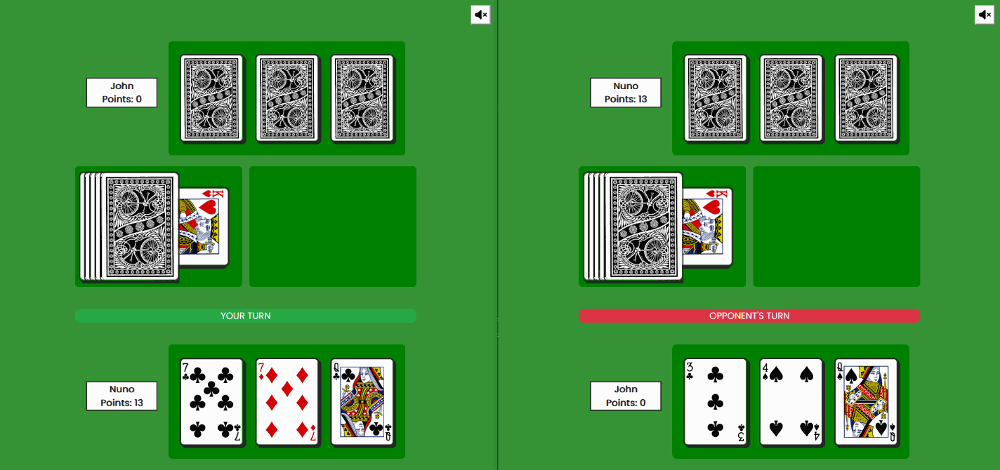
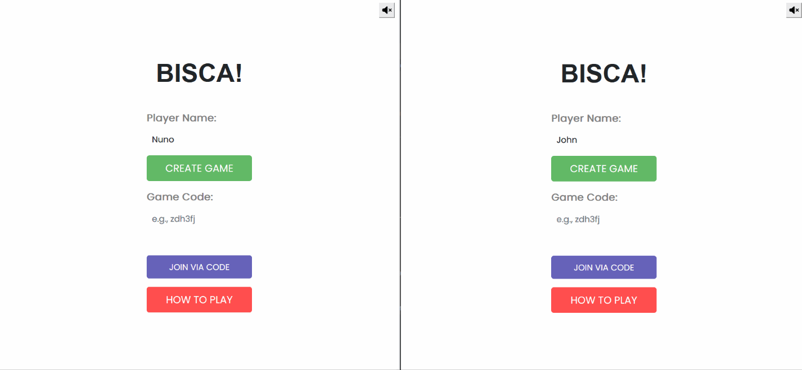

# Bisca Portuguese Card Trick Game

This is a simple web-based multiplayer implementation of the Bisca Portuguese card trick game.

- Real-time gameplay with interactive animations using Framer Motion.
- Dynamic deck of cards rendered from the Deck of Cards API.
- User-friendly interface with intuitive game mechanics.
- Score tracking with in-game card history.

Website: https://bisca-multiplayer.up.railway.app/

## Table of Contents
- [Demo](#demo)
- [Overview](#overview)
- [Installation](#installation)
- [Technologies Used](#technologies-used)
- [Acknowledgements](#acknowledgements)
- [Areas of Improvement](#areas-for-improvement)

## Demo

### Gameboard Demo

### Menu Demo

## Overview
Bisca is a Portuguse card game that focuses on winning card-tricks. The game
is popular in many countries, such as Portugal, Spain, Cape Verde, etc. The game is similar to its Italian equivalent, Briscola.

The game starts with both players being dealt three cards, and one additional card being drawn as the trump card. 

The implementation provided is a complete online equivalent of the game, allowing users to connect online and play against one another. The game features dynamic spring animation courtesy of Framer Motion, and dynamic card renders courtesy of the Deck of Cards API.

## Installation

### Running Locally

1. Install all necessary dependencies and packages with the following command: `npm install`. 
2. Update npm globally by running the following command: `npm install -g npm`.
3. In the `AccordionMenu.js` and `Card.js` files, replace all instances of `.PNG` with `.png` (for some odd reason cloud deployment requires the extension to be in uppercase).
4. Open the `socket.js` file and uncomment the code for local deployment. Comment out all other code outside of the local deployment code.
5. Open the terminal and type the following command to start the server: `npm run start`.
6. Open your web browser and access the project at `https://localhost:3000` address.

### Running on Cloud (Heroku, Render, Etc.)

1. Install all necessary dependencies and packages with the following command: `npm install`. 
2. Update npm globally by running the following command: `npm install -g npm`.
3. Open the terminal and type the following command to create a fresh build for deployment:  `npm run build`.
4. In your cloud platform (Heroku, Render, etc.), replace the default build command with the following:  `npm install; npm run build `.
5. In your cloud platform, replace the default start command with the following: `npm run start:server`.
6. Once deployed, open your web browser and access the project at the default domain address given by the cloud platform.

## Technologies Used
- **Node.js**: An open-source JavaScript runtime environment.
- **React**: A popular JavaScript library for building user interfaces.
- **React Bootstrap**: A front-end framework that replaces Bootstrap JavaScript
- **Framer Motion**: A powerful animation library for React.
- **Deck of Cards API**: An API that provides a deck of cards for use in web applications.

## Acknowledgements
- **font-awesome**: An icon library toolkit for CSS
- **oombi**: A well-designed multiplayer game that inspired this project
- **freepd**: Free-public domain music used for the background. The track used for the project was "Martini Sunset". (The music can be found at: https://freepd.com/misc.php)

## Areas for Improvement
- [X] Animate the waiting page.
- [X] Include a tutorial or help section for new players.
- [X] Develop a mobile-responsive version of the game.
- [X] Implement a promise delay function to replace the timeout function in the server.
- [X] Implement an end animation that moves the card trick towards the winning player.
- [X] Fix a mismatch between the client's perception and the received game state when clicking a card too fast.
- [X] Replace the cloud platform Render with Railway.app to prevent spin down during momemnts of inactivity.
- [ ] Make the objects follow the SOLID principles. 
- [ ] Add sound effects for card draw and card placement.
- [ ] Handle disconnects and allow the disconnecting player to return to a game after a set period.
- [ ] Preload the API images for the top cards on the deck for faster load times.
- [ ] Implement a CPU opponent for single-player interaction.
- [ ] Add a three-player, four-player mode (including the team variant of Bisca).
- [ ] Clean up the code in general, remove deprecated packages, make the code more user-readable.
- [ ] Implement a useEffect when moving the cards to a new location, rather than calling the function continuously. 
